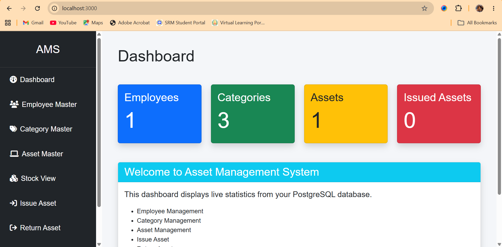
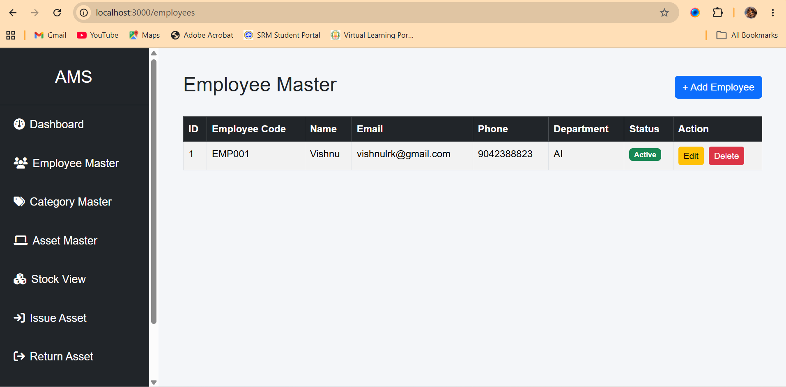
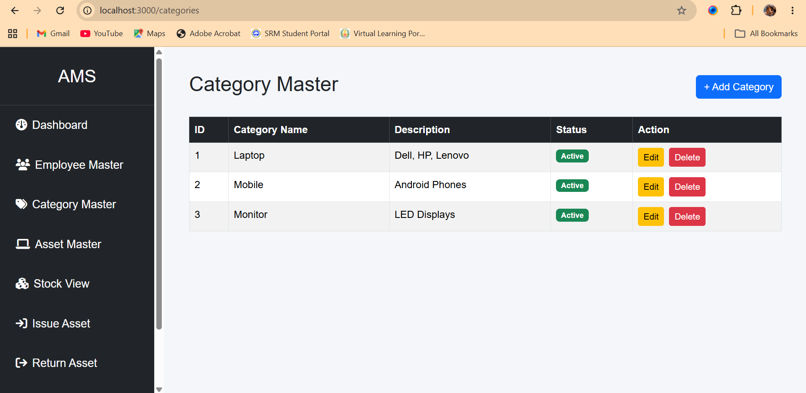
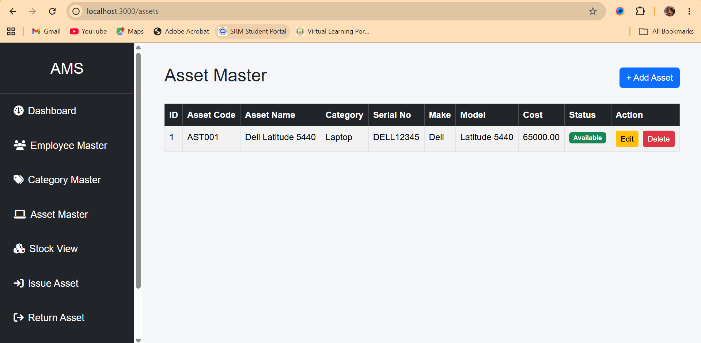
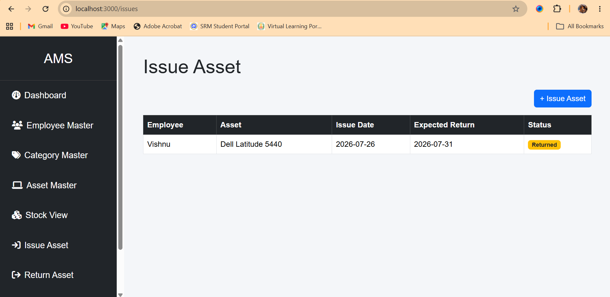
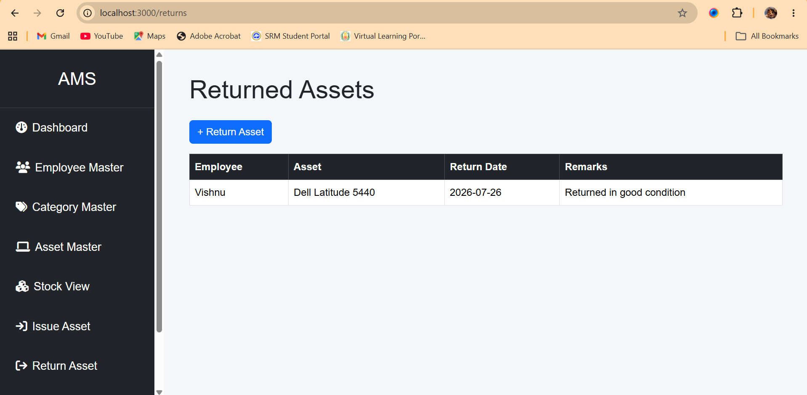
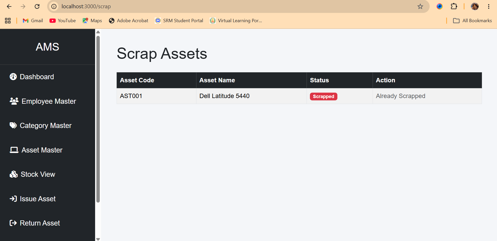
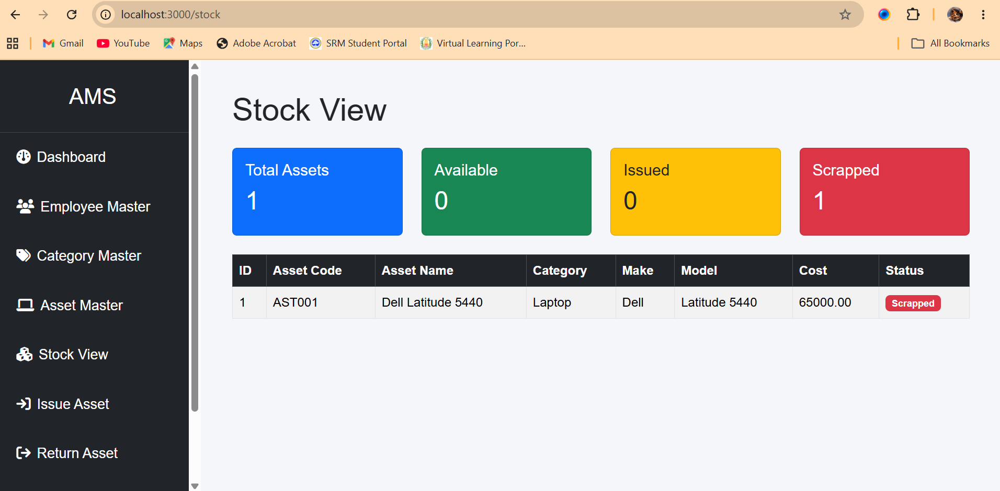

# Asset Management System

A web-based Asset Management System developed using **Node.js, Express.js, PostgreSQL, Sequelize ORM, Pug, and Bootstrap**.

This application helps organizations manage company assets by tracking employees, asset categories, asset inventory, asset allocation, returns, and scrapped assets.

---

## Features

- Dashboard with live statistics
- Employee Management (CRUD)
- Category Management (CRUD)
- Asset Management (CRUD)
- Issue Assets to Employees
- Return Issued Assets
- Scrap Assets
- Stock View
- PostgreSQL Database Integration
- Responsive User Interface using Bootstrap

---

## Technology Stack

| Technology | Purpose |
|------------|---------|
| Node.js | Backend Runtime |
| Express.js | Web Framework |
| PostgreSQL | Database |
| Sequelize ORM | ORM |
| Pug | Template Engine |
| Bootstrap | UI Framework |
| HTML/CSS | Frontend |

---

## Project Structure

```text
AssetManagement
│
├── config
├── controllers
├── models
├── public
├── routes
├── views
│
├── app.js
├── package.json
└── README.md
```

---

## Database Tables

- Employees
- Categories
- Assets
- AssetIssues
- AssetReturns

---

## Asset Workflow

```text
Asset Created
      │
      ▼
 Available
      │
      ▼
 Issued
      │
      ▼
 Returned
      │
      ▼
 Available
      │
      ▼
 Scrapped
```

---

## Installation

### Clone Repository

```bash
git clone https://github.com/yourusername/asset-management-system.git
```

### Navigate to Project

```bash
cd asset-management-system
```

### Install Dependencies

```bash
npm install
```

### Configure PostgreSQL

Update the database credentials in:

```
config/database.js
```

### Start Application

```bash
npm start
```

Application runs at:

```
http://localhost:3000
```

---

## Modules

- Dashboard
- Employee Master
- Category Master
- Asset Master
- Issue Asset
- Return Asset
- Scrap Asset
- Stock View

---

## Application Screenshots

### Dashboard



---

### Employee Master



---

### Category Master



---

### Asset Master



---

### Issue Asset



---

### Return Asset



---

### Scrap Asset



---

### Stock View



## Future Enhancements

- User Authentication
- Role-Based Access Control
- Reports
- Excel Export
- PDF Export
- Email Notifications

---

## Author

**Vishnu Rathinakumar**
